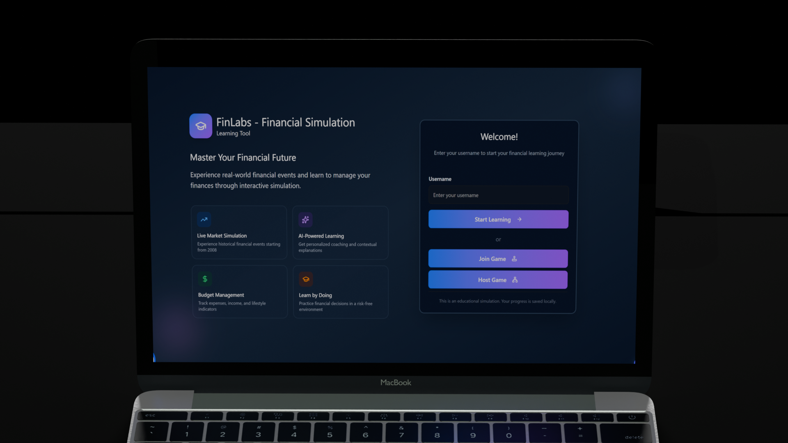
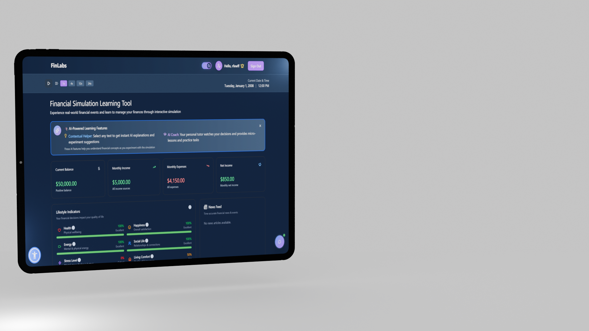

# FinLabs - Financial Simulation Learning Tool

<div align="center">
  
  <br>
  
  

  **Experience real-world financial events and learn to manage your finances through interactive simulation**

  [](https://reactjs.org/)
  [](https://www.typescriptlang.org/)
  [](https://vitejs.dev/)
  [](https://tailwindcss.com/)
</div>

---
## Before you start reading
To get an in-depth understanding of our project, we recommend checking out the  as well.

## Value Proposition

**Learn Financial Literacy Through Interactive Simulation**

FinLabs transforms financial education from theory into practice. Instead of reading about budgeting and investing, you'll experience real-world financial scenarios starting from the 2008 financial crisis. Make decisions, see consequences, and build financial intuition in a risk-free environment powered by AI-driven insights.

Perfect for:
- Students learning personal finance
- Young professionals starting their financial journey
- Educators teaching financial literacy
- Anyone wanting to practice financial decision-making

---

## What is FinLabs?

FinLabs is an interactive web application that simulates real-world financial scenarios. Starting from January 2008, you'll navigate through actual historical events while managing your budget, investing in stocks, and making lifestyle decisions.

### Key Features

**Financial Simulation**
- Real-time budget dashboard tracking balance, income, and expenses
- Historical stock market data with realistic price movements
- Time-controlled simulation with adjustable speed (1x to 10x)
- Dynamic news feed featuring actual historical financial events

**AI-Powered Learning**
- Intelligent chatbot financial advisor with access to your complete financial state
- Contextual help on any selected text or financial term
- Automated performance evaluations every minute
- Personalized insights and recommendations based on your decisions

**Interactive Management**
- Comprehensive expense tracking and adjustment
- Income source management
- Stock trading with real market data
- Lifestyle indicators showing quality of life metrics
- Financial history charts and visualizations

**Multiplayer Support**
- Host or join multiplayer sessions
- Real-time leaderboard showing player rankings
- Synchronized game state across all players
- Competitive learning environment

**Modern UX**
- Beautiful, responsive design with Tailwind CSS
- Smooth animations with Framer Motion
- Accessible UI components from Radix UI
- Progressive Web App - install on any device
- Dark mode support

---

## Tech Stack

### Core Framework
- **React 19.2.0** - Latest React with concurrent features
- **TypeScript 5.9.3** - Type-safe development
- **Vite 7.2.2** - Lightning-fast build tool and dev server

### State Management & Data Fetching
- **Redux Toolkit 2.10.1** - Predictable state container
- **RTK Query** - Powerful data fetching and caching
- **Redux Persist 6.0.0** - Persist state across sessions

### Routing
- **React Router DOM 7.9.6** - Client-side routing

### Styling & UI
- **Tailwind CSS 4.1.17** - Utility-first CSS framework
- **Radix UI** - Unstyled, accessible component primitives
  - Accordion, Dialog, Dropdown, Popover, Tabs, Tooltip, and more
- **Framer Motion 12.23.24** - Animation library
- **Lucide React 0.553.0** - Beautiful icon set
- **class-variance-authority** - CSS class variance management

### Data Visualization
- **Recharts 3.4.1** - Composable charting library

### Forms & Validation
- **React Hook Form 7.66.0** - Performant form validation

### Notifications
- **Sonner 2.0.7** - Toast notifications
- **Notistack 3.0.2** - Snackbar notifications

### HTTP Client
- **Axios 1.13.2** - Promise-based HTTP client

### Development Tools
- **ESLint 9.39.1** - Code linting
- **Prettier 3.6.2** - Code formatting

---

## Installation Instructions

### Prerequisites
- **Node.js** 18.x or higher
- **npm** or **yarn** package manager

### Setup Steps

1. **Clone the repository**
   ```bash
   git clone <repository-url>
   cd junction-frontend
   ```

2. **Install dependencies**
   ```bash
   npm install
   ```

3. **Configure environment variables** (if needed)
   Create a `.env` file in the root directory and add your backend API URL:
   ```env
   VITE_API_URL=your_backend_api_url
   ```

4. **Start the development server**
   ```bash
   npm run dev
   ```

   The application will be available at `http://localhost:5173`

### Build for Production

```bash
npm run build
```

This creates an optimized production build in the `dist` directory.

### Preview Production Build

```bash
npm run preview
```

---

## Usage

### Getting Started

1. **Login/Register** - Create an account to save your progress
2. **Choose Mode**:
   - **Single Player** - Practice on your own
   - **Host Multiplayer** - Create a session and invite friends
   - **Join Multiplayer** - Join an existing session

3. **Start Simulation** - Press play to begin your financial journey from 2008

4. **Manage Finances**:
   - Monitor your budget dashboard
   - Adjust expenses in real-time
   - Invest in stocks based on market trends
   - React to news events

5. **Get AI Assistance**:
   - Click the chatbot icon for financial advice
   - Select any text for contextual help
   - Receive periodic performance evaluations

### Time Controls

- **Play/Pause** - Control simulation flow
- **Speed** - Adjust from 1x to 10x speed
- **Current Date** - Track your progress through time

### Tabs Overview

- **Expenses** - View and adjust your spending
- **Income** - Track all income sources
- **Stocks** - Buy and sell stocks
- **Actions** - Take special actions (housing, lifestyle changes)

---

## Available Scripts

| Command | Description |
|---------|-------------|
| `npm run dev` | Start development server |
| `npm run build` | Build for production |
| `npm run preview` | Preview production build |
| `npm run lint` | Run ESLint |

---

## Project Structure

```
junction-frontend/
    public/              # Static assets and PWA icons
    src/
        components/      # React components
        ui/         # Reusable UI components
        ...         # Feature components
        pages/          # Page components
        redux/          # Redux store and slices
        api/        # RTK Query API definitions
        hooks/          # Custom React hooks
        utils/          # Utility functions
        types/          # TypeScript type definitions
        layout/         # Layout components
        routes/         # Route configurations
    generate-icons.js   # PWA icon generator script
    package.json        # Dependencies and scripts
```

---

## Acknowledgments

Built by Rapole Krupauskaite, Zsombor Horváth, Dániel Gergely, Mátyas Nyilas and Dénes Balogh for Junction 2025 Hackathon

**Technologies & Libraries**: React, TypeScript, Tailwind CSS, Redux Toolkit, Radix UI, and many other amazing open-source projects.
